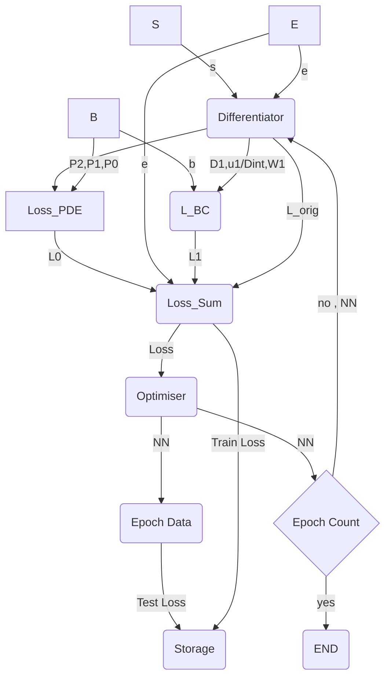
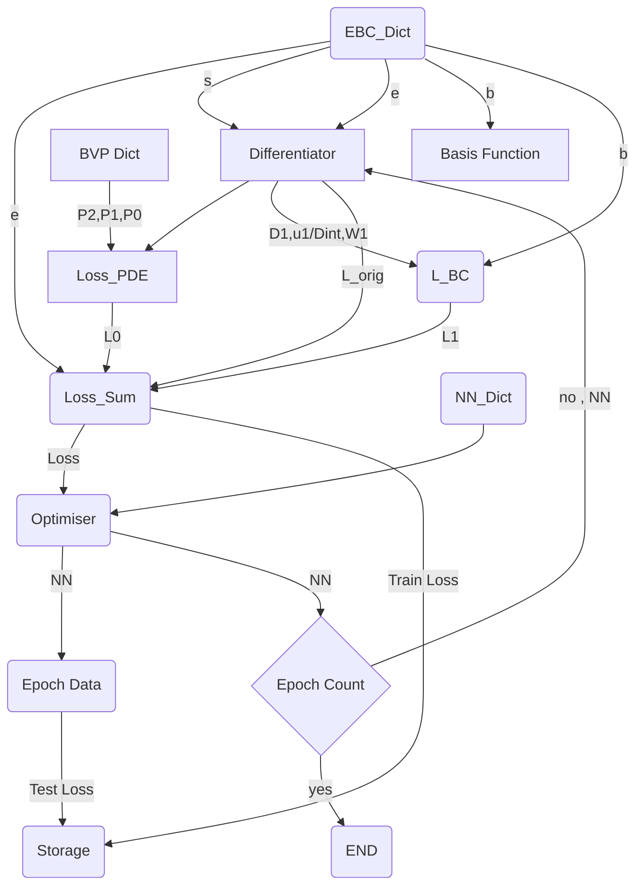

# Program Design

```mermaid
graph TD

    A[S] -->|s| B(Differentiator)

    G[E] -->|e| B

    B --> C[Loss_PDE]

    H[BVP Dict] --> |P2,P1,P0| C

    C --> |L0| D(Loss_Sum)

    G --> |e| D

    H[B] --> |b| I(L_BC)

    B --> |D1,u1/Dint,W1| I

    I --> |L1| D

    B --> |L_orig| D

    D --> |Loss| J(Optimiser)

    J --> |NN| K(Epoch Data)

    K--> |Test Loss| L(Storage)

    D --> |Train Loss| L

    J --> |NN| M{Epoch Count}

    M --> |yes| N(END)

    M -->|no , NN| B
```

```mermaid
flowchart TD

    B[Differentiator] --> C[Loss_PDE]

    Q[BVP Dict] --> |P2,P1,P0| C

    C --> |L0| D(Loss_Sum)

    O --> |e| D

    B --> |D1,u1/Dint,W1| I

    I(L_BC) --> |L1| D

    B --> |L_orig| D

    D --> |Loss| J(Optimiser)

    P(NN_Dict) -->J

    J --> |NN| K(Epoch Data)

    K--> |Test Loss| L(Storage)

    D --> |Train Loss| L

    J --> |NN| M{Epoch Count}

    M --> |yes| N(END)

    M -->|no , NN| B

    O(EBC_Dict) -->|s| B

    O --> |e| B

    O -->|b| H[Basis Function]

    O -->|b| I
```

